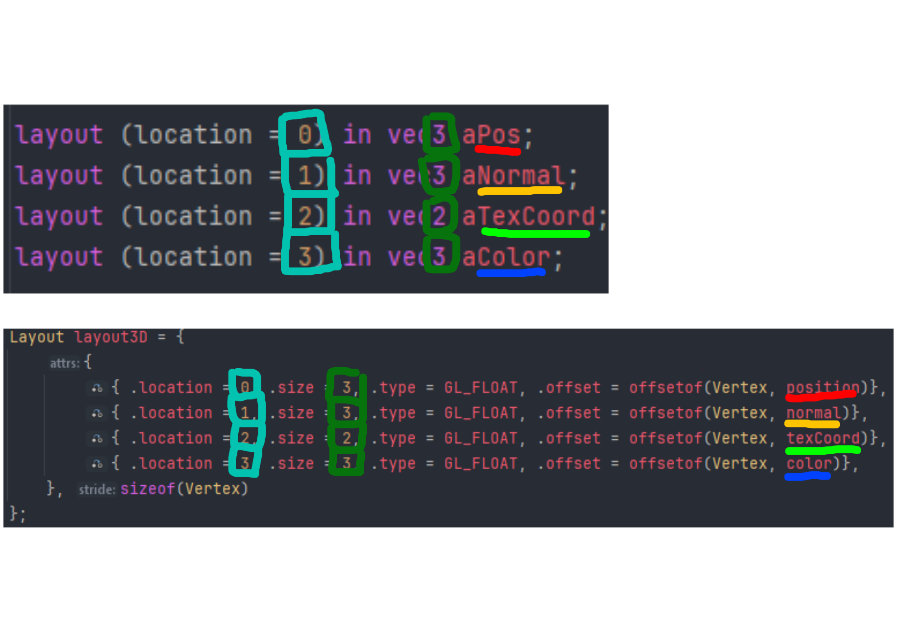

# Rendering & Render Pipeline

## GLSL & Shaders
**What does `shader.vert` mean?**
Vertex shader handles the vertex transformations.

**What does `shader.frag` mean?**
Fragment shader handles pixel colors.

This project uses GLSL (Graphics Library Shading Language) for shaders.

## Data layout
Each `layout(location = N) in <type> <name>` in GLSL maps 1:1 to a VertexAttribute:

(Source: `3d_scene.vert`)
```glsl
layout (location = 0) in vec3 aPos; // -> { location: 0, size: 3, type: GL_GLOAT, offset: offsetof(Vertex, position) }
layout (location = 1) in vec3 aNormal; // -> { location: 1, size: 3, type: GL_GLOAT, offset: offsetof(Vertex, normal) }
layout (location = 2) in vec2 aTexCoord; // -> { location: 2, size: 2, type: GL_GLOAT, offset: offsetof(Vertex, texCoord) }
layout (location = 3) in vec3 aColor; // -> { location: 3, size: 3, type: GL_GLOAT, offset: offsetof(Vertex, color) }
```
Image for demonstration:


## Pipeline

First you create shader program
```cpp
ShaderProgram program;
```
After that you create shaders where you specify paths in the constructor and their type `ShaderType`
```cpp
// Example paths of shaders
Shader frag {"assets/shaders/3d_scene.frag", ShaderType::Fragment};
Shader vert{"assets/shaders/3d_scene.vert", ShaderType::Vertex};
```
> [!NOTE]
> All the `ShaderType`s are following
```cpp
enum class ShaderType : unsigned int {
    Vertex          = GL_VERTEX_SHADER,
    Fragment        = GL_FRAGMENT_SHADER,
    Geometry        = GL_GEOMETRY_SHADER,
    TessControl     = GL_TESS_CONTROL_SHADER,
    TessEvaluation  = GL_TESS_EVALUATION_SHADER,
    Compute         = GL_COMPUTE_SHADER
};
```
And then you compile the shaders before linking them
```cpp
frag.compile();
vert.compile();
```
Then the shaders are attached to a desired `ShaderProgram`
```cpp
program.attach(vert);
program.attach(frag);

program.link();
```
After that, you create `vao` (Vertex Array Object), `vbo` (Vertex Buffer Object) and `ebo` (Element Buffer Object).

However, `ebo` is not necessary for the functionality of the shaders, but it's highly recommended to use it to save memory and performance.

All of these objects are created using `Buffer` class and for `vao` specifically `VertexArray` class.  This all is handled by `Mesh` class, but we will take more in depth dive.

Shortly, this is what they mean and do:
- `vao` - holds the data.
- `vbo` - describes how to organize the data.
- `ebo` - describes how to connect vertices (data) together to draw any shape without defining the same point multiple times.

## Mesh rendering
First we create those objects
```cpp
// For buffers specifically, we need to specify target usage
VertexArray vao;
Buffer vbo { GL_ARRAY_BUFFER };
Buffer ebo { GL_ELEMENT_ARRAY_BUFFER };
```
And add `VertexAttribute`, this describes the layout of the data
```cpp
std::vector<VertexAttribute> layout = {
    { 0, 3, GL_FLOAT, offsetof(Vertex, position) },
    { 1, 3, GL_FLOAT, offsetof(Vertex, normal) },
    { 2, 2, GL_FLOAT, offsetof(Vertex, texCoord) },
    { 3, 3, GL_FLOAT, offsetof(Vertex, color) },
};
```
The fields `position`, `normal`, `texCoord` and `color` are fields of the struct `Vertex`.
```cpp
glm::vec3 position{};
glm::vec3 normal{0.0f, 1.0f, 0.0f};
glm::vec2 texCoord{0.0f};
glm::vec3 color{1.0f};
```
To add uniforms you call `setUniform` inside shader program.
```cpp
void setUniform(const std::string& name, bool value);
void setUniform(const std::string& name, int value);
...

// Other definitions inside shader_program.hpp
```
For our example, we will set camera `view` and camera `projection` matrix and camera `position` as 3D vector.
```cpp
ctx.program.setUniform("u_view", ctx.camera.getViewMatrix());
ctx.program.setUniform(
        "u_projection", 
        
        // getProjectionMatrix() is perspective-only
        ctx.camera.getProjectionMatrix(ctx.window.getAspect())
);

ctx.program.setUniform("u_cameraPos", ctx.camera.getPosition());
```
> [!NOTE]
> Shader for 3D space in VoxelFox also uploads lights in similar way.

> [!IMPORTANT]
> The uniform name must match the uniform name declared in the GLSL shader source.

And also set uniform for the mesh's matrix we want to render:
```cpp
ctx.program.setUniform("u_model", meshInstance->getGlobalMatrix());
```
Then we have to upload data to all the object buffers we created earlier via `upload` method.
(Uploading is done in `mesh.cpp` in method `setup`)
```cpp
vao.bind();

// Vertices
vbo.upload(this->vertices.data(), this->vertices.size() * sizeof(Vertex));

// Indices
ebo.upload(this->indices.data(), this->indices.size() * sizeof(GLuint));
```
And then also upload the layout of the data:
```cpp
// In-engine example
Layout layout3D = {
    {
        { 0, 3, GL_FLOAT, offsetof(Vertex, position) },
        { 1, 3, GL_FLOAT, offsetof(Vertex, normal) },
        { 2, 2, GL_FLOAT, offsetof(Vertex, texCoord) },
        { 3, 3, GL_FLOAT, offsetof(Vertex, color) },
    }, sizeof(Vertex)
};

layout3D.upload();
```

Then call `render` on the mesh itself.
```cpp
void Mesh::render(const ShaderProgram& program) const {
    program.use();
    vao.bind();

    glDrawElements(GL_TRIANGLES, static_cast<GLsizei>(this->indices.size()), GL_UNSIGNED_INT, nullptr);
}
```
> [!TIP]
> To see whole implementation of rendering nodes and meshes, visit `mesh_renderer.cpp` and `mesh.cpp`